# Event Storming

## Agregados

### Usuário

Responsável pelo cadastro e autenticação dos usuários do sistema, contemplando tanto compradores quanto proprietários de veículos.

#### 1 - Cadastrar Usuário

Cadastra um usuário no sistema com os seguintes dados:

- Nome
- CPF
- Sexo
- Data de nascimento
- E-mail
- Senha

Gera o evento `Usuário Cadastrado`.

#### 2 - Autenticar Usuário

Identifica o usuário no sistema por meio do e-mail e senha.

Gera o evento `Usuário Autenticado`.

### Veículo

Responsável pelo controle dos veículos disponíveis para venda no sistema.

#### 1 - Cadastrar Veículo

Um usuário autenticado pode cadastrar um ou mais veículos no sistema com os seguintes dados:

- Marca
- Modelo
- Ano
- Cor
- Preço

Gera o evento `Veículo Cadastrado`.

#### 2 - Atualizar Veículo

Um usuário autenticado pode atualizar os dados de qualquer um dos seus veículos cadastrados.

Gera o evento `Veículo Atualizado`.

#### 3 - Vender Veículo

Altera o status do veículo para vendido.

Gera o evento `Veículo Vendido`.

### Venda

Gerencia o processo de venda dos veículos.

#### 1 - Iniciar Venda

Um usuário autenticado pode iniciar a compra de um veículo, informando:

- Usuário comprador
- Veículo selecionado
- Proposta de valor
- Data

Gera o evento `Venda Iniciada`.

#### 2 - Concluir Venda

O usuário autenticado proprietário do veículo confirma e conclui a venda.

Gera o evento `Venda Concluída`.

#### 3 - Cancelar Venda

O usuário autenticado — comprador ou proprietário — pode cancelar a venda a qualquer momento antes de sua conclusão.

Gera o evento `Venda Cancelada`.

## Diagrama

```mermaid
flowchart LR
    classDef ev fill:#FFF6B6,color:#000,stroke:#FFF6B6
    classDef cmd fill:#03BCD4,color:#000,stroke:#03BCD4
    classDef at fill:#F8D3AF,color:#000,stroke:#F8D3AF
    classDef ag fill:#FE9F4D,color:#000,stroke:#FE9F4D
    classDef pol fill:#CF84E0,color:#000,stroke:#CF84E0
    classDef ml fill:#89C871,color:#000,stroke:#89C871
    
    subgraph Usuário
        T01[Comprador]:::at
        T02[Proprietário]:::at
        C01[Cadastrar Usuário]:::cmd
        C02[Autenticar Usuário]:::cmd
        E01[Usuário Cadastrado]:::ev
        E02[Usuário Autenticado]:::ev
        T01-->C01
        T02-->C01
        C01-->E01
        E01-->C02
        C02-->E02
    end

    subgraph Veículo
        C03[Cadastrar Veículo]:::cmd
        C04[Atualizar Veículo]:::cmd
        C05[Vender Veículo]:::cmd
        E03[Veículo Cadastrado]:::ev
        E04[Veículo Atualizado]:::ev
        E05[Veículo Vendido]:::ev
        E02-->C03
        T02-->C03
        C03-->E03
        E03-->C04
        C04-->E04
        C05-->E05
    end

    subgraph Venda
        M01[Usuários]:::ml
        M02[Veículos]:::ml
        C06[Iniciar Venda]:::cmd
        C07[Concluir Venda]:::cmd
        C08[Cancelar Venda]:::cmd
        E06[Venda Iniciada]:::ev
        E07[Venda Concluida]:::ev
        E08[Venda Cancelada]:::ev
        E04-->C06
        M01-->C06
        M02-->C06
        T01-->C06
        C06-->E06
        E06-->C07
        E06-->C08
        T01-->C08
        T02-->C08
        C07-->E07
        E07-->C05
        C08-->E08
    end
```

