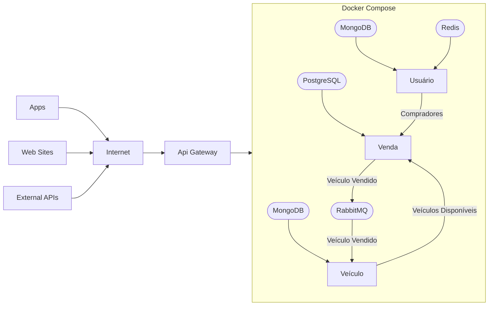

# Arquitetura

A arquitetura do sistema segue o padrão de **microsserviços**, com separação explícita de responsabilidades de domínio e independência de deploy entre componentes. A comunicação entre serviços é híbrida:

- **Síncrona (REST)** para consultas e operações que exigem resposta imediata  
- **Assíncrona (mensageria)** para propagação de eventos e desacoplamento operacional  

Essa abordagem busca equilibrar **consistência, performance e resiliência**, evitando tanto o acoplamento excessivo quanto a complexidade desnecessária de um sistema puramente orientado a eventos.

O acesso externo é centralizado via **API Gateway**, que atua como ponto único de entrada, responsável por:

- roteamento  
- autenticação  
- controle de acesso  
- padronização de endpoints  

Todo o ambiente é provisionado via **Docker Compose**, priorizando simplicidade operacional e reprodutibilidade local.

---

## Decisão arquitetural central

A arquitetura assume explicitamente que:

> **nem toda comunicação deve ser eventual e nem toda operação deve ser síncrona**

Isso leva a um modelo híbrido onde:
- consultas e validações críticas → síncronas  
- efeitos colaterais e propagação de estado → assíncronos  

### Trade-offs dessa decisão

**Vantagens**
- Redução de latência em operações críticas  
- Menor complexidade cognitiva em fluxos simples  
- Melhor previsibilidade para o consumidor da API  

**Desvantagens**
- Possibilidade de inconsistência temporária entre serviços  
- Necessidade de lidar com idempotência e reprocessamento  
- Maior esforço de observabilidade (logs distribuídos)  

---

## Microsserviços

Todos os microsserviços seguem:

- **Clean Architecture**  
- **Arquitetura Hexagonal (Ports and Adapters)**  

Isso permite:

- troca de tecnologia sem impacto no domínio  
- maior testabilidade  
- menor acoplamento com frameworks  

### Trade-offs dessa escolha

**Prós**
- Código mais sustentável a longo prazo  
- Testes mais simples e confiáveis  
- Facilidade de evolução arquitetural  

**Contras**
- Aumento de boilerplate  
- Curva de aprendizado maior  
- Risco de overengineering em serviços simples

### Linguagem

Todos os microsserviços serão escritos em Asp.Net Core com C#.

## Testes

Todos os microsserviços devem possuir cobertura de **testes unitários**, garantindo a validação isolada das regras de negócio e a previsibilidade do comportamento do sistema.

Os testes são obrigatórios para as seguintes camadas:

- **UseCases**
  - validação dos fluxos de aplicação
  - garantia de orquestração correta entre componentes
  - verificação de cenários de sucesso e erro

- **Services (Domain/Application Services)**
  - validação de regras de negócio
  - testes de lógica pura, sem dependência de infraestrutura
  - cobertura de cenários limite e regras condicionais

- **Domain Models**
  - validação de invariantes do domínio
  - consistência interna das entidades
  - proteção contra estados inválidos

### Trade-offs

**Vantagens**
- maior confiabilidade do sistema
- facilidade de refatoração com segurança
- documentação viva das regras de negócio
- redução de regressões em ambientes distribuídos

**Desvantagens**
- aumento do tempo inicial de desenvolvimento
- necessidade de disciplina na escrita e manutenção dos testes
- possível duplicação de esforço se mal estruturado

### Observações

- Testes **não devem depender de infraestrutura externa** (banco, mensageria, rede)
- Dependências devem ser isoladas via **mocks ou stubs**
- Testes de integração e E2E são complementares, mas não substituem os testes unitários

---

## Serviços

### UserApi

Responsável por:

- cadastro de usuários  
- autenticação  
- emissão de tokens JWT  

O token é **assimétrico**, permitindo validação distribuída via chave pública.

Utiliza:
- **MongoDB** → persistência principal  
- **Redis** → cache de leitura  

#### Trade-offs

**JWT assimétrico**
- ✔ elimina dependência de chamada central para autenticação  
- ✔ melhora escalabilidade  
- ✖ exige gestão segura de chaves  
- ✖ dificulta revogação imediata de tokens  

**MongoDB**
- ✔ flexibilidade de schema  
- ✔ rápido para leitura simples  
- ✖ ausência de joins pode exigir duplicação de dados  

**Redis (cache)**
- ✔ melhora latência  
- ✔ reduz carga no banco  
- ✖ risco de inconsistência (cache stale)  
- ✖ necessidade de estratégia de invalidação  

---

### VehicleApi

Responsável por:

- cadastro de veículos  
- atualização de dados  
- controle de disponibilidade  

Requer autenticação via UserApi para operações de escrita.

Utiliza:
- **MongoDB**

#### Trade-offs

**Dependência síncrona de autenticação**
- ✔ segurança centralizada  
- ✔ simplicidade de implementação  
- ✖ acoplamento operacional com UserApi  

**MongoDB**
- ✔ flexível para atributos variáveis de veículos  
- ✖ pode gerar inconsistência se regras de negócio forem distribuídas  

---

### SalesApi

Responsável por:

- gerenciamento do ciclo de vida de vendas:
  - iniciar  
  - concluir  
  - cancelar  
- orquestração de dados entre usuários e veículos  
- publicação de eventos  

Utiliza:
- **PostgreSQL**

Publica evento ao concluir venda.

#### Trade-offs

**Banco relacional (PostgreSQL)**
- ✔ consistência forte  
- ✔ adequado para transações  
- ✔ integridade referencial  
- ✖ menor flexibilidade estrutural  

**Orquestração entre serviços**
- ✔ centraliza lógica de negócio  
- ✔ reduz duplicação  
- ✖ cria dependência de múltiplos serviços  
- ✖ aumenta latência em operações compostas  

---

## Mensageria

Gerenciada pelo **RabbitMQ**.

Fila definida:

- **VehicleSold**
  - publicada pelo SalesApi  
  - consumida pelo VehicleApi  

Essa comunicação segue padrão de **event-driven integration**.

### Trade-offs

**Vantagens**
- desacoplamento entre serviços  
- maior resiliência (retry, buffer)  
- melhor escalabilidade  

**Desvantagens**
- consistência eventual  
- necessidade de idempotência no consumidor  
- debugging mais complexo  

---

## Consistência de dados

A arquitetura adota **consistência eventual entre serviços**.

Exemplo:
- venda concluída → evento publicado  
- veículo atualizado posteriormente  

### Implicações

- estados transitórios são possíveis  
- UI deve lidar com pequenas inconsistências temporárias  
- logs e rastreamento são essenciais  

---

## API Gateway

Gerenciado pelo **Kong**, configurado declarativamente.

Responsabilidades:

- roteamento  
- autenticação  
- rate limiting (potencial)  
- abstração da topologia interna  

### Trade-offs

**Vantagens**
- centralização de políticas  
- simplificação para clientes  
- desacoplamento entre cliente e serviços  

**Desvantagens**
- ponto único de falha (se não houver redundância)  
- possível gargalo de performance  
- aumento da latência inicial  

---

## Infraestrutura

Provisionamento via **Docker Compose**.

### Trade-offs

**Vantagens**
- simplicidade  
- baixo custo operacional  
- ideal para desenvolvimento e ambientes pequenos  

**Desvantagens**
- limitações de escala  
- ausência de auto-healing  
- não adequado para produção de alta disponibilidade  

> Evolução natural: Kubernetes

---

## Observabilidade (lacuna atual)

A arquitetura atual **não explicita**:

- tracing distribuído  
- correlação de logs  
- métricas  

### Risco

Em ambiente distribuído, sem isso:
- debugging se torna caro  
- análise de falhas fica limitada  
- SLA difícil de garantir  

---

## Possíveis evoluções

- Introdução de **orquestrador de processos (saga / workflow)**  
- Implementação de **observabilidade (OpenTelemetry)**  
- Migração de Compose → Kubernetes  
- Versionamento de eventos (evitar breaking changes)  
- Introdução de **anti-corruption layers** entre serviços  

---

## Diagrama

